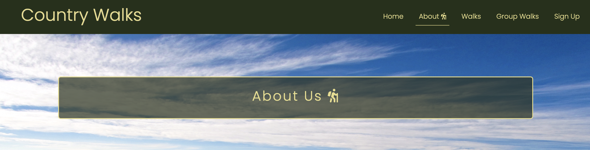
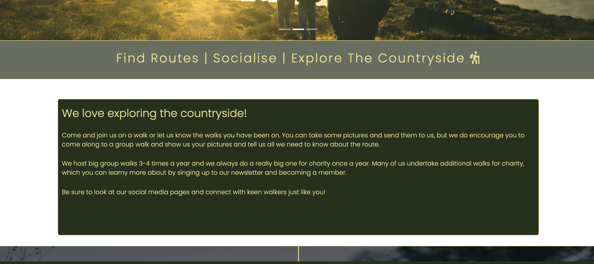

# <strong>Country Walks</strong>

(Developer: Ben Cookesley)

[Live webpage](https://bcookesley.github.io/CI_pp1_country-walks/)

 
 
 
 

# Table of Contents

1. [Project Goals](#project-goals)
    1. [User Goals](#user-goals)
    2. [Site Owner Goals](#site-owner-goals)
2. [User Experience](#user-experience)
    1. [Target Audience](#target-audience)
    2. [User Requirements and Expectations](#user-requirements-and-expectations)
    3. [User Stories](#user-stories)
3. [Design](#design)
    1. [Design Choices](#design-choices)
    2. [Colour](#colour)
    3. [Fonts](#fonts)
    4. [Structure](#structure)
    5. [Wireframes](#wireframes)
4. [Technologies Used](#technologies-used)
    1. [Languages](#languages)
    2. [Frameworks & Tools](#frameworks-and-tools)
5. [Credits](#credits)
6. [Acknowledgements](#acknowledgements)

# Project Goals

 

### User Goals
- Finding a place where you can see walking routes done by others
- Seeing photos and images taken on the walking routes shown
- Find any walking events happening 
- Locate a community of walkers

 

### Site Owner Goals
- Provide useful information on walking routes for safety and wellbeing of anyone not familiar with the areas covered
- Boost a community of walkers and ramblers 
- Display a walking challenges to suit a variety of different experiences 

 

## User Experience 

 

### Target Audience
- People who enjoy a good walk 
- People looking to find new walking routes
- People looking for a community of walkers and ramblers
- People who enjoy the counrtyside and enjoy taking landscape photos

 

### User Requirements and Expectations
- Easy to read and relevant information 
- Easily navigate their way through the website 
- Visually appealing design that is clean and inviting and is responsive to any device they're on
- Easy to read information
- Links to events and social media pages 
- Easily contact someone related to the website
- Accessibility

 

### User Stories 

 

#### First Time User 
- As a first time user, I want to know what Country Walks is about
- As a first time user, I want to know if I can find any good walking routes to try and what to expect
- As a first time user, I want to see some images from any walks or routes shown
- As a first time user, I want to know if there are any group walks to join

 

#### Returning User 
- As a returning user, I want to see any social events or group walks happening and where
- As a returning user, I want to see if any new photos have been added
- As a returning user, I want to see if there are any new walking routes to try
- As a returning user, I want to contact someone at Country Walks

 

#### Site Owner 
- As a site owner, I want users to be able to engage with a community of people who like to walk
- As a site owner, I want users to be able to contact someone
- As a site owner, I want users to be able to find and see walking routes they could try for themselves

 

## Design

### Design Choices

This website was designed so that the user has a sense and feeling of being in the countryside. Using colours found in nature that represents the trees, the ground and the landscape the user should feel at ease being on this site. 

 

### Colour

Again, the colours used on this website is to reflect the colours you shoudl find in the great outdoors. Using green, brown, white and off white colours complement nicely. I used Adobe Colour to find the mix of colours to use and wrote some quick code on the index.html page to put these colours to the test. 

 

### Fonts 

Fonts imported form Google fonts and includes Poppins and Roboto with a sans-serif as a fallback. Clean and easy to read fonts were important for the user on this website so the information is clear and easy to read.

 

### Structure

The layout and structure of the website is set in a familiar and user friendly way. Navigation links set to the right of the page and the title on the left as the majority of people read left to right. The website consists of 5 separate pages. 
- A home page with sections for brief info and next big group walk
- An about us page with information on what the webite is and a small gallery of images below 
- A walks page, which details some walking routes reccommended by the website
- A group walks page that shows the major group walks that are organised 
- A sign up page where the user can sign up to a newsletter and become a member

 

### Wireframes

<strong>Home Page</strong>

Home - Desktop

<image src="docs/wireframes/CW-Home-Desktop.png">

Home - Tablet

<image src="docs/wireframes/CW-Home-Tablet.png">

Home - Mobile

<image src="docs/wireframes/CW-Home-Mobile.png">

<strong>About Us Page</strong>

About - Desktop

<image src="docs/wireframes/CW-About-Desktop.png">

About - Tablet

<image src="docs/wireframes/CW-About-Tablet.png">

About - Mobile

<image src="docs/wireframes/CW-About-Mobile.png">

<strong>Walks Page</strong>

Walks - Desktop

<image src="docs/wireframes/CW-Walks-Desktop.png">

Walks - Tablet

<image src="docs/wireframes/CW-Walks-Tablet.png">

Walks - Mobile

<image src="docs/wireframes/CW-Walks-Mobile.png">

<strong>Group Walks Page</strong>

Group Walks - Desktop

<image src="docs/wireframes/CW-GroupWalks-Desktop.png">

Group Walks- Tablet

<image src="docs/wireframes/CW-GroupWalks-Tablet.png">

Group Walks - Mobile

<image src="docs/wireframes/CW-GroupWalks-Mobile.png">

<strong>Sign Up Page</strong>

Sign Up - Desktop

<image src="docs/wireframes/CW-SignUp-Desktop.png">

Sign Up - Tablet

<image src="docs/wireframes/CW-SignUp-Tablet.png">

Sign Up - Mobile

<image src="docs/wireframes/CW-SignUp-Mobile.png">

 

## Technologies Used 

### Languages 
- HTML
- CSS

 

## Testing User Stories

1. As a first time user, I want to know what Country Walks is about.

| **Feature** | **Action** | **Expected Result** | **Actual Result** |
|-------------|------------|---------------------|-------------------|
| About Us | Navigate to the about us page, scroll down | Locating the about us information | Worked as expected |
| Home | Go to website and scroll down | Locate a brief intro | Worked as expected |

Screenshots

2. As a first time user, I want to know if I can find any good walking routes to try and what to expect.

| **Feature** | **Action** | **Expected Reult** | **Actual Result** |
|-------------|------------|--------------------|-------------------|
| Walks Page | Navigate to walks page and scroll down | Locating the walks page and the walks list | Worked as expected |

### Frameworks & Tools
- Bootstrap V5.1
- Git
- Github
- Gitpod
- Font Awesome V 5.15.4
- Google Fonts
- Balsamiq

 
 
 
 
 
 
 

## Credits 

 

## Acknowledgements

I would like to give my thanks to:

- Mo Shami for the guidance and support he offered through this
- To my loving partner Cazz Pickles for her support and inspiration she gave for the project
- All the people at Code institute 
- And to my cat Zuzu for keeping me company
