# <strong>Country Walks</strong>

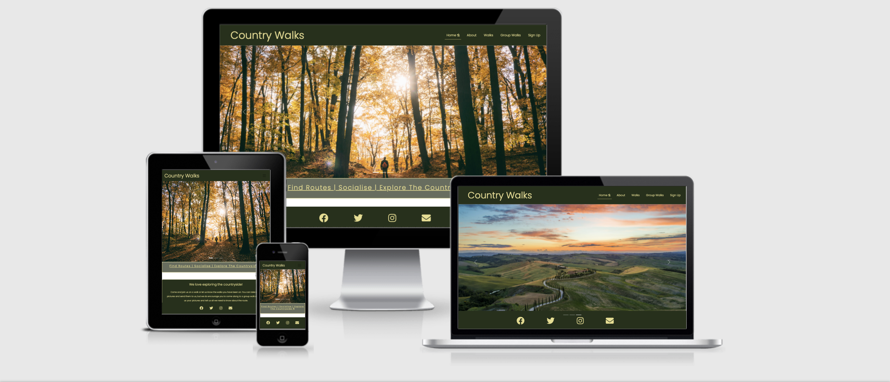

(Developer: Ben Cookesley)

[Live webpage](https://bcookesley.github.io/CI_pp1_country-walks/)

# Table of Contents

1. [Project Goals](#project-goals)
    1. [User Goals](#user-goals)
    2. [Site Owner Goals](#site-owner-goals)
2. [User Experience](#user-experience)
    1. [Target Audience](#target-audience)
    2. [User Requirements and Expectations](#user-requirements-and-expectations)
    3. [User Stories](#user-stories)
3. [Design](#design)
    1. [Design Choices](#design-choices)
    2. [Colour](#colour)
    3. [Fonts](#fonts)
    4. [Structure](#structure)
    5. [Wireframes](#wireframes)
4. [Technologies Used](#technologies-used)
    1. [Languages](#languages)
    2. [Frameworks & Tools](#frameworks-and-tools)
5. [Features](#features)
    1. [Navigation Bar](#navigation-bar)
    2. [Carousel](#carousel)
    3. [Next Group Walk](#next-group-walk)
    4. [Walks](#walks)
    5. [Newsletter and Sign Up](#newsletter-and-sign-up)
    6. [Footer](#footer)
    7. [About Us](#about-us)
6. [Testing](#validation)
    1. [HTML Validation](#html-validation)
    2. [CSS Validation](#css-validation)
    3. [Accessibility](#accessibility)
    4. [Performance](#performance)
    5. [Performance Tests on Various Devices](#performance-tests-on-various-devices)
    6. [Browser Compatability](#browser-compatability)
    7. [Testing User Stories](#testing-user-stories)
7. [Bugs](#bugs)
8. [Deployment](#deployment)
9. [Credits](#credits)
10. [Acknowledgements](#acknowledgements)

# Project Goals

### User Goals
- Finding a place where you can see walking routes done by others
- Seeing photos and images taken on the walking routes shown
- Find any walking events happening 
- Locate a community of walkers

### Site Owner Goals
- Provide useful information on walking routes for safety and wellbeing of anyone not familiar with the areas covered
- Boost a community of walkers and ramblers 
- Display a walking challenges to suit a variety of different experiences 

## User Experience 

### Target Audience
- People who enjoy a good walk 
- People looking to find new walking routes
- People looking for a community of walkers and ramblers
- People who enjoy the counrtyside and enjoy taking landscape photos

### User Requirements and Expectations
- Easy to read and relevant information 
- Easily navigate their way through the website 
- Visually appealing design that is clean and inviting and is responsive to any device they're on
- Easy to read information
- Links to events and social media pages 
- Easily contact someone related to the website
- Accessibility

### User Stories 

#### First Time User 
1. As a first time user, I want to know what Country Walks is about
2. As a first time user, I want to know if I can find any good walking routes to try and what to expect
3. As a first time user, I want to see some images from any walks or routes shown
4. As a first time user, I want to know if there are any group walks to join

#### Returning User 
5. As a returning user, I want to see any social events or group walks happening and where
6. As a returning user, I want to see if any new photos have been added
7. As a returning user, I want to see if there are any new walking routes to try
8. As a returning user, I want to contact someone at Country Walks

#### Site Owner 
9. As a site owner, I want users to be able to engage with a community of people who like to walk
10. As a site owner, I want users to be able to contact someone
11. As a site owner, I want users to be able to find and see walking routes they could try for themselves
12. As a site owner I don't want users to use the back button on the browser while on the website

## Design

### Design Choices

This website was designed so that the user has a sense and feeling of being in the countryside. Using colours found in nature that represents the trees, the ground and the landscape the user should feel at ease being on this site. 

### Colour

Again, the colours used on this website is to reflect the colours you shoudl find in the great outdoors. Using green, brown, white and off white colours complement nicely. I used Adobe Colour to find the mix of colours to use and wrote some quick code on the index.html page to put these colours to the test. 

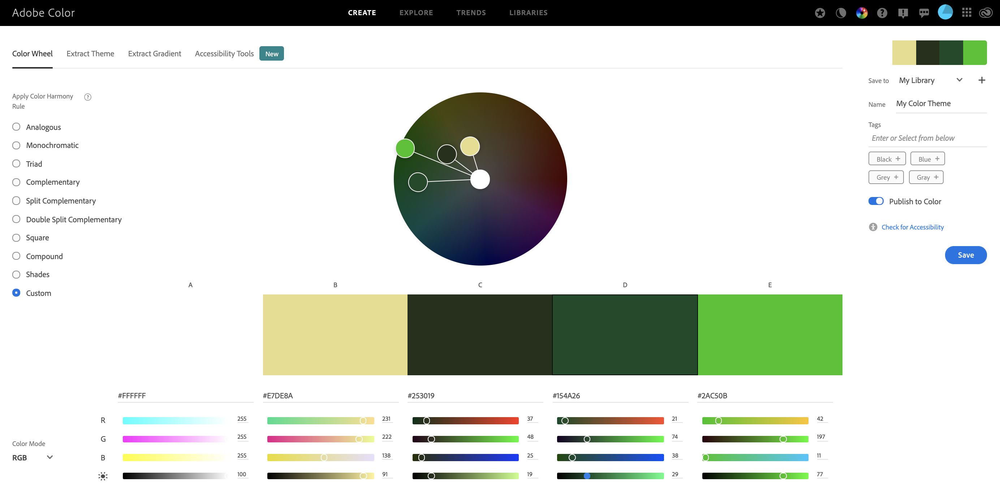

### Fonts 

Fonts imported form Google fonts and includes Poppins and Roboto with a sans-serif as a fallback. Clean and easy to read fonts were important for the user on this website so the information is clear and easy to read.

### Structure

The layout and structure of the website is set in a familiar and user friendly way. Navigation links set to the right of the page and the title on the left as the majority of people read left to right. The website consists of 5 separate pages. 
- A home page with sections for brief info and next big group walk
- An about us page with information on what the webite is and a small gallery of images below 
- A walks page, which details some walking routes reccommended by the website
- A group walks page that shows the major group walks that are organised 
- A sign up page where the user can sign up to a newsletter and become a member

### Wireframes

<strong>Home Page</strong>

Home - Desktop

<image src="docs/wireframes/CW-Home-Desktop.png">

Home - Tablet

<image src="docs/wireframes/CW-Home-Tablet.png">

Home - Mobile

<image src="docs/wireframes/CW-Home-Mobile.png">

<strong>About Us Page</strong>

About - Desktop

<image src="docs/wireframes/CW-About-Desktop.png">

About - Tablet

<image src="docs/wireframes/CW-About-Tablet.png">

About - Mobile

<image src="docs/wireframes/CW-About-Mobile.png">

<strong>Walks Page</strong>

Walks - Desktop

<image src="docs/wireframes/CW-Walks-Desktop.png">

Walks - Tablet

<image src="docs/wireframes/CW-Walks-Tablet.png">

Walks - Mobile

<image src="docs/wireframes/CW-Walks-Mobile.png">

<strong>Group Walks Page</strong>

Group Walks - Desktop

<image src="docs/wireframes/CW-GroupWalks-Desktop.png">

Group Walks- Tablet

<image src="docs/wireframes/CW-GroupWalks-Tablet.png">

Group Walks - Mobile

<image src="docs/wireframes/CW-GroupWalks-Mobile.png">

<strong>Sign Up Page</strong>

Sign Up - Desktop

<image src="docs/wireframes/CW-SignUp-Desktop.png">

Sign Up - Tablet

<image src="docs/wireframes/CW-SignUp-Tablet.png">

Sign Up - Mobile

<image src="docs/wireframes/CW-SignUp-Mobile.png">

## Technologies Used 

### Languages 
- HTML
- CSS

### Frameworks & Tools
- Bootstrap V5.1
- Git
- Github
- Gitpod
- Font Awesome V 5.15.4
- Google Fonts
- Balsamiq

## Features 

### Navigation Bar 

- Features on all 5 pages
- Fully responsive and changes to the hamburger menu on smaller screens and includes all 5 pages with an underline and icon to keep the user on track for what page they're on.
- Easy to read
- Allows the user to easily navigate through the site

### Carousel 

- Shows the user images of walks people have done and taken pictures of in a three picture slide show
- User is able navigate through the pictres (left to right or right to left) with left and right arrows

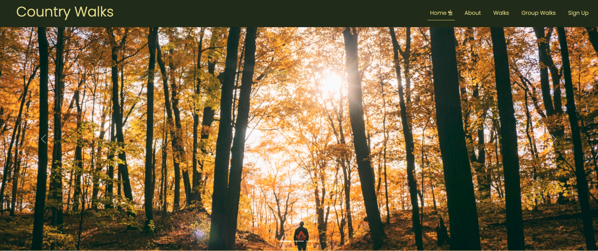

### Next Group Walk

- Allows the user to see the next group walks they can join
- Group walk info is clear and easy to read (see user story 4 & 5)

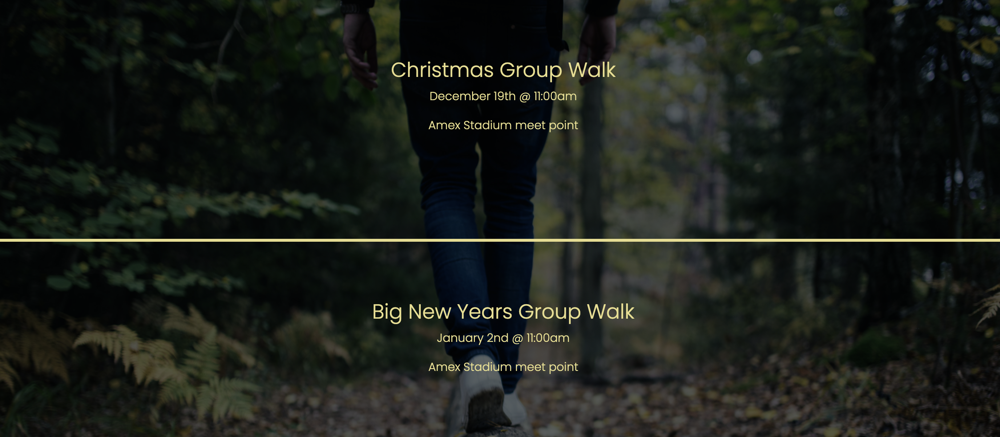

### Walks

- Allows the user to see and look through reccommended walks, short, medium, long and most popular
- Covered in user stories (2 & 7)

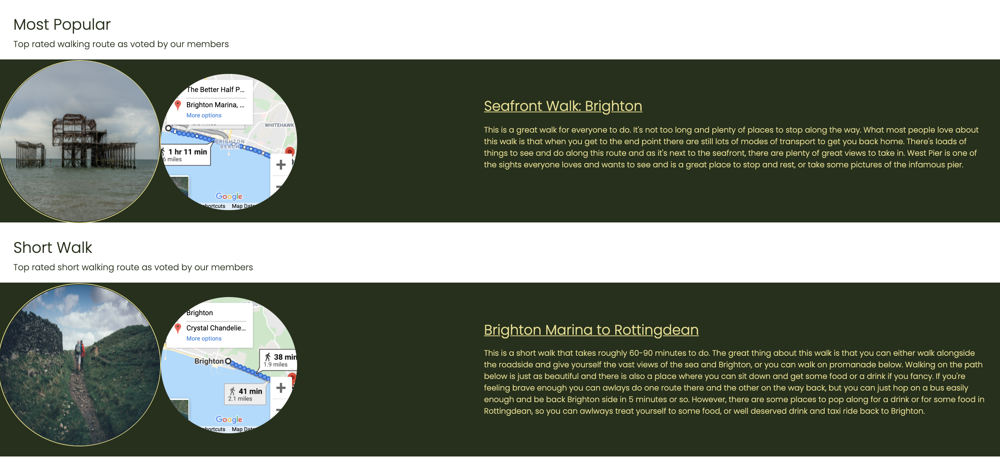

### Newsletter and Sign Up

- Allows user to sign up to the sites newsletter and become a member
- Additional benefits of more walking routes to explore for user

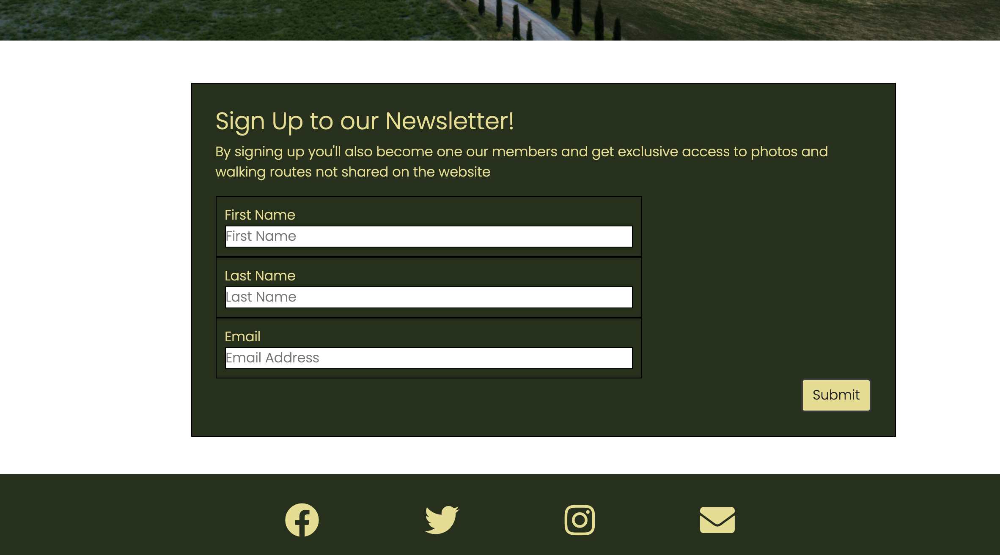

### Footer

- Features on all 5 pages of the site 
- Has 3 social accounts linked - Facebook, Instagram and Twitter
- Has email so user can get in touch

### About Us 

- Provides the user with some information on the site, what they do and how the user can interact with the social groups
- Covered in user story (1)

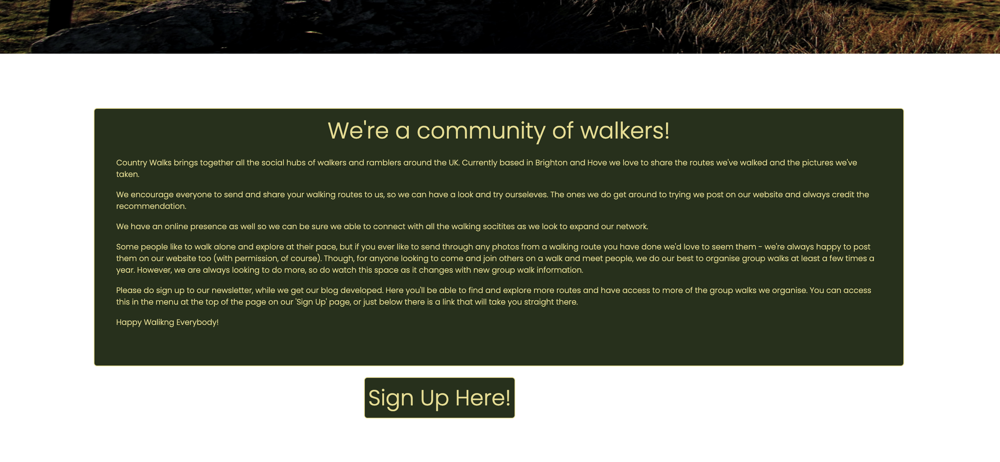

## Validation 

### HTML Validation 

The W3C Markup Validation service was used to validate all 5 pages of HTML code. All pages passed with no errors, but some warnings on about us page due to no headings on a particular section. This is a design choice. 

Home

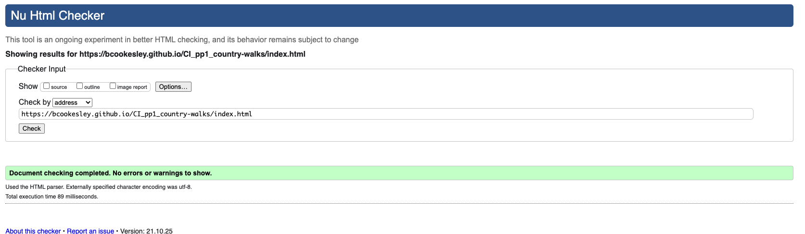

About Us

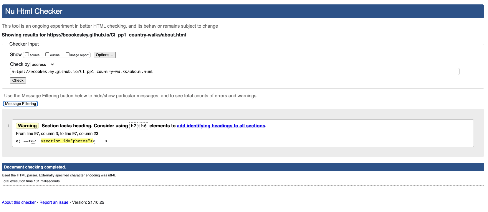

Walks

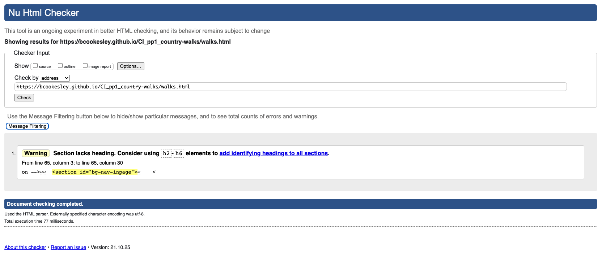

Group Walks

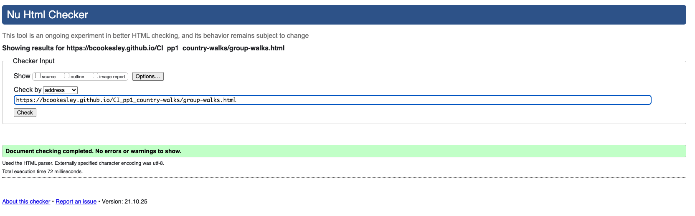

Sign Up

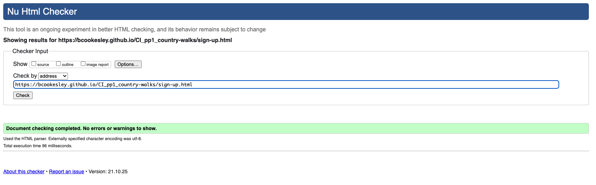

### CSS Validation

The W3C CSS Validation Service was used to validate the CSS code by URL and direct input. All CSS code showed to pass all code by URL and direct input.

Whole Page

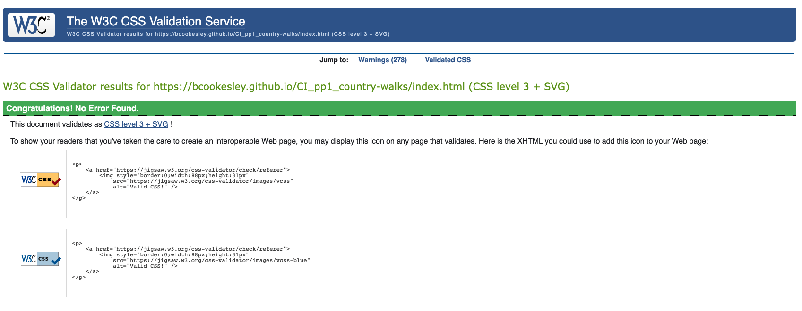

Direct Input (style.css)

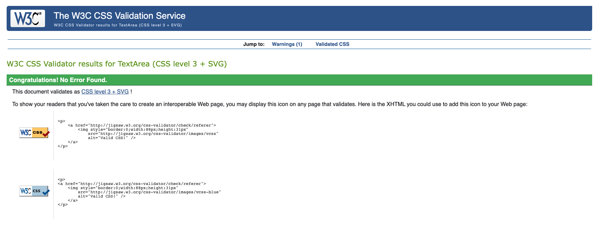

### Accessibility 

WAVE WebAIM was used to ensure the website meets accessibility standards. All pages found no errors, but some warnings on a couple of pages due to a stylistic choice made to not include headings on a photos section.

Home

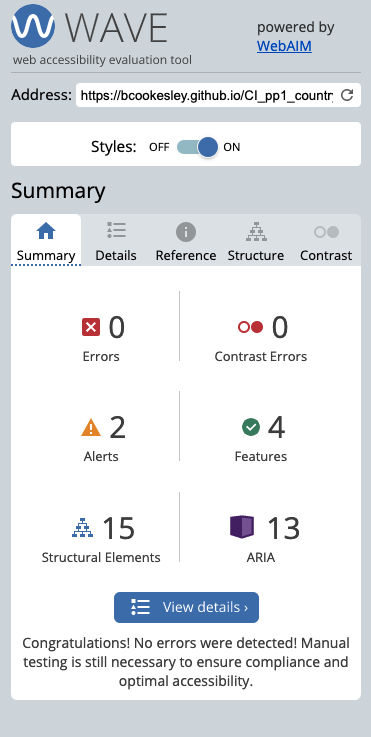

About Us

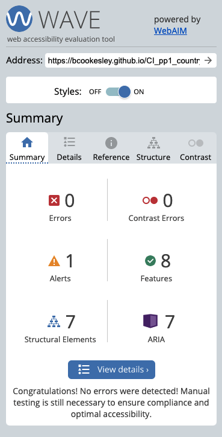

Walks

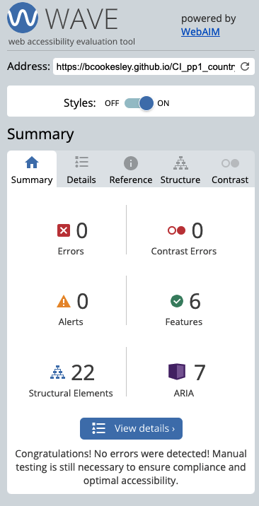

Group Walks

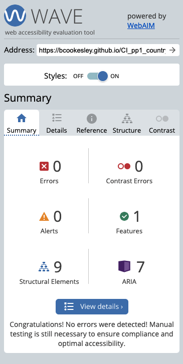

Sign Up

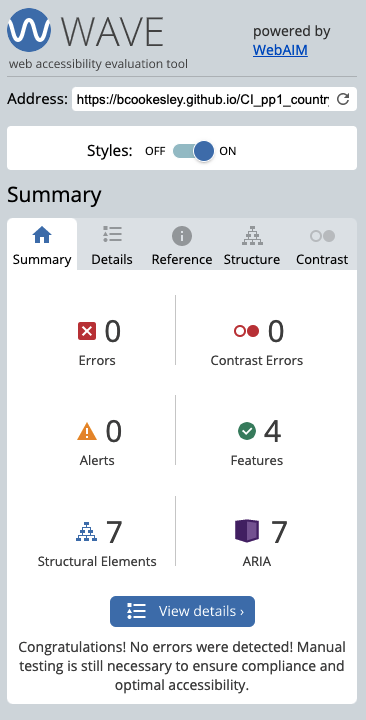

## Performance 

Google Lighthouse in Chrome Developer tools was used to test the performance of the website.

Home

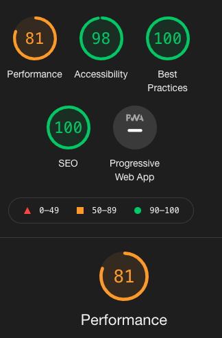

About

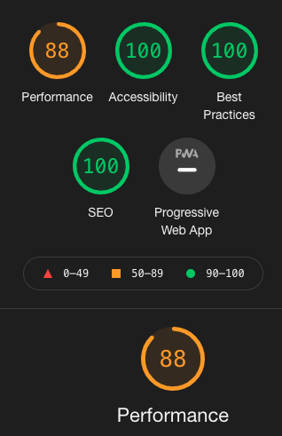

Walks

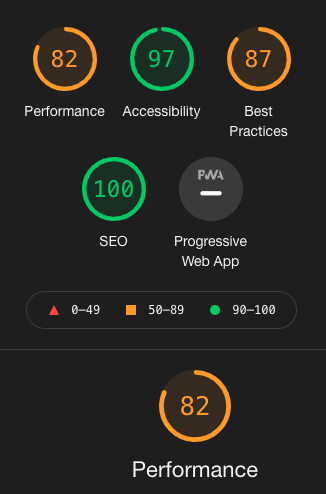

Group Walks

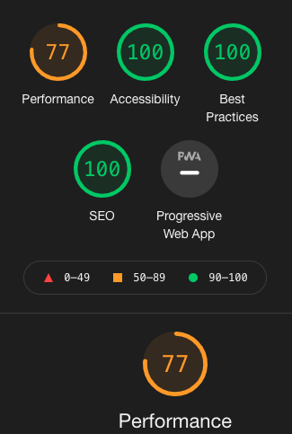

Sign Up

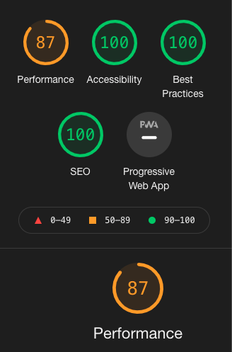

## Performance Tests on Various Devices

In addition to the tests done on Chrome Developer tools this website was also tested on:

- Samsung S10/S20
- Apple iPad

## Browser Compatability 

This website was tested on the following browsers:

- Google Chrome
- Mozilla Firefox
- Safari V 14.1.2

## Testing User Stories

1. As a first time user, I want to know what Country Walks is about.

| **Feature** | **Action** | **Expected Result** | **Actual Result** |
|-------------|------------|---------------------|-------------------|
| About Us | Navigate to the about us page, scroll down | Locating the about us information | Worked as expected |
| Home | Go to website and scroll down | Locate a brief intro | Worked as expected |

Screenshots

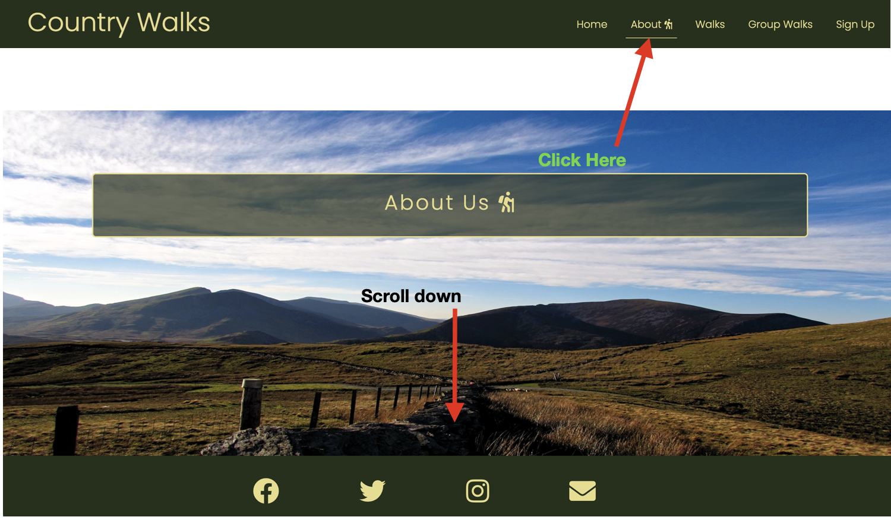

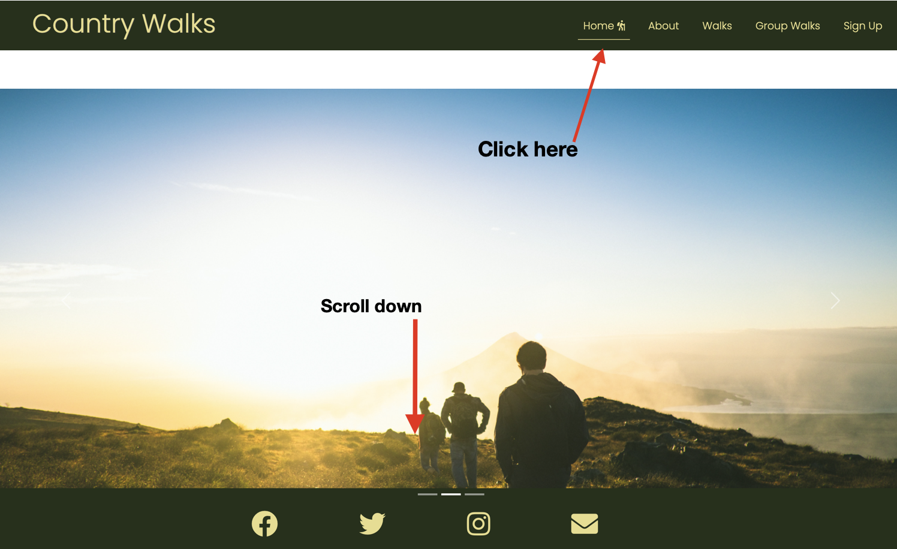
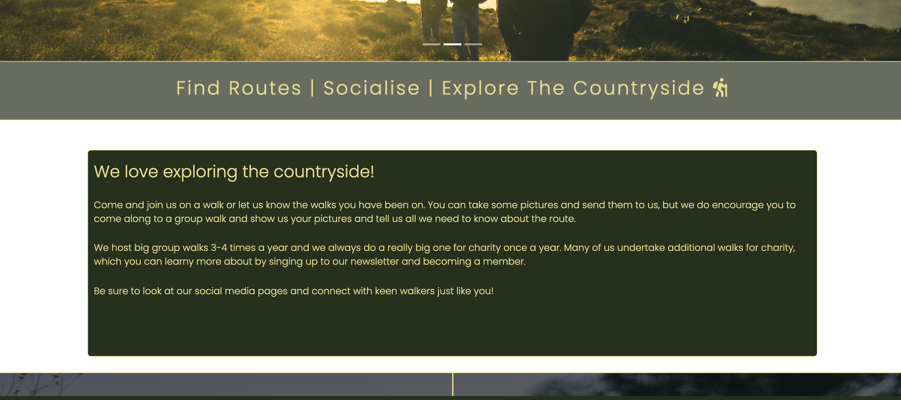

2. As a first time user, I want to know if I can find any good walking routes to try and what to expect.

| **Feature** | **Action** | **Expected Reult** | **Actual Result** |
|-------------|------------|--------------------|-------------------|
| Walks Page | Navigate to walks page and scroll down | Locating the walks page and the walks list | Worked as expected |

Screenshots

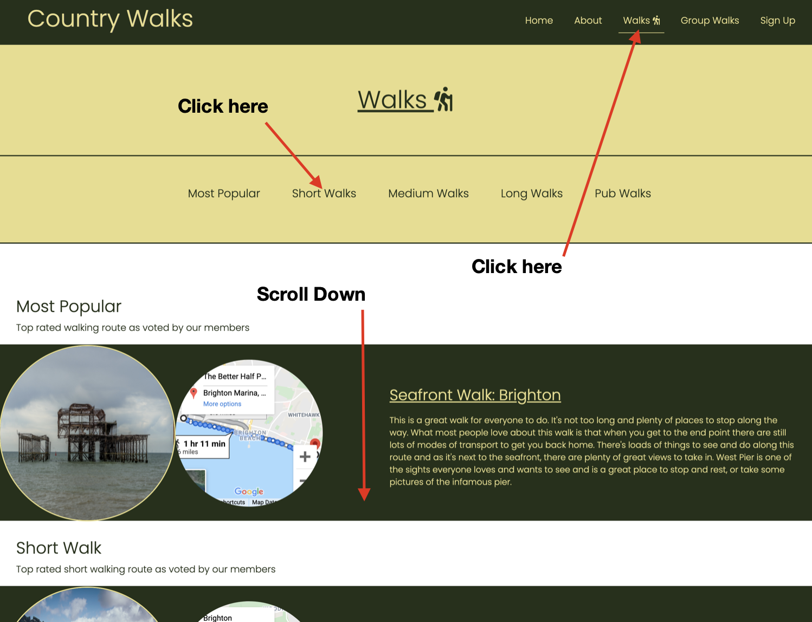

3. As a first time user, I want to see some images from any walks or routes shown.

| **Feature** | **Action** | **Expected Result** | **Actual Result** |
|-------------|------------|---------------------|-------------------|
| Gallery on About Us page | Navigate to about us page and scroll to see images | Locate images below about us information | Worked as expected |
| Social links on footer | Scroll to the bottom of the page to locate footer and social links | Find social links for more pictures | Works as expected |

Screenshots

4. As a first time user, I want to know if there are any group walks to join.

| **Feature** | **Action** | **Expected Result** | **Actual Result** |
|-------------|------------|---------------------|-------------------|
| Next group walk | Go to website and scroll down on home page | Locate the next 2 group walks taking place | Works as expected |
| Group Walks page | Navigate to the group walks page and scroll down | Locate all the opwn group walks available to join | Works as expected |
| Next Group Walk | Go to website and scroll down | Locate the next group walk info | Works as expected |

Screenshots

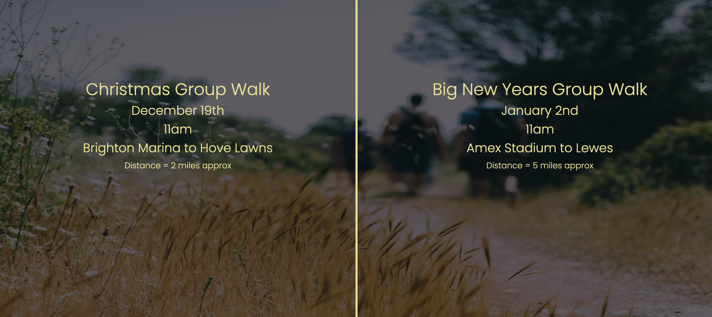
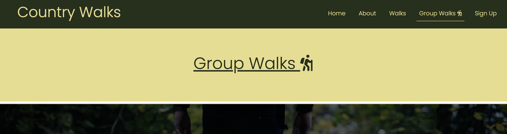

5. As a returning user, I want to see any social events or group walks happening and where.

| **Feature** | **Action** | **Expected Result** | **Actual Result** |
|-------------|------------|---------------------|-------------------|
| Next group walks | Go to home page of website and scroll down | Locate the next group walk times and details | Works as expected |
| Facebook group | Scroll down on any page and find Facebook icon on footer and click | Directs the user to Facebook | Works as expected |

Screenshots

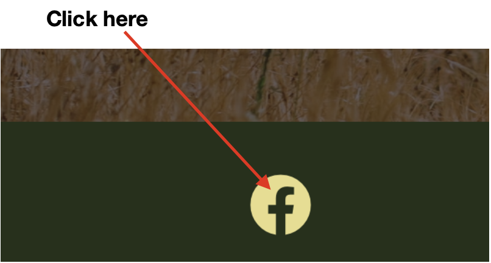

6. As a returning user, I want to see if any new photos have been added.

| **Feature** | **Action** | **Expected Result** | **Actual Result** |
|-------------|------------|---------------------|-------------------|
| About Us page / Gallery | Navigate to about us page and scroll down | Locate the gallery | Works as expected |
| Instagram | Scroll down on any page and click on the Instagram icon on the footer | Locate Instagram icon and be directed there | Works as expected |

Screenshots

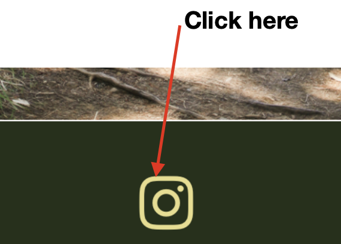

7. As a returning user, I want to see if there are any new walking routes to try.

| **Feature** | **Action** | **Expected Result** | **Actual Result** |
|-------------|------------|---------------------|-------------------|
| Walks page | Navigate to walks page and scroll down | Locate all the walks currently listed by the website | Works as expected |
| Footer social links | Scroll down on any page and find the social links on the footer | Locate social links and click on them to be directed to a social networking site | Works as expected |

Screenshots

8. As a returning user, I want to contact someone at Country Walks.

| **Feature** | **Action** | **Expected Result** | **Actual Result** |
|-------------|------------|---------------------|-------------------|
| Footer | Scroll down any page to find the envelope icon and click | Directed to Gmail email | Works as expected |
| Footer socials | Scroll down any page to find any of the social media icons and click | Directed to a social media page | Works as expected |

Screenshots

9. As a site owner, I want users to be able to engage with a community of people who like to walk.

| **Feature** | **Action** | **Expected Result** | **Actual Result** |
|-------------|------------|---------------------|-------------------|
| Footer Socials | Scroll down any pageto find social media links on footer | Directed to any of the social media pages | Works as expected |
| About us page | Navigate to about us page | Find infromation on website, social links and newsletter | Works as expected|
| Sign Up page | Navigate to Sign Up page | Locate sign up form for newsletter and additional benefits for becoming a member | Works as expected |

Screenshots

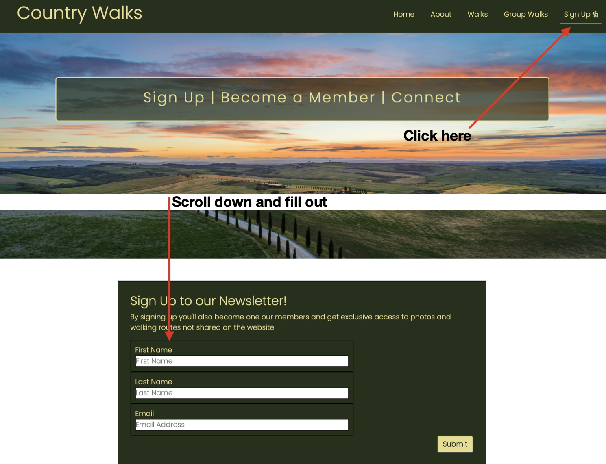

10. As a site owner, I want users to be able to contact someone.

| **Feature** | **Action** | **Expected Result** | **Actual Result** |
|-------------|------------|---------------------|-------------------|
| Footer email | Scroll down any page and click on envelope icon | Directed to Gmail | Works as expected|

Screenshots

11. As a site owner, I want users to be able to find and see walking routes they could try for themselves.

| **Feature** | **Action** | **Expected Result** | **Actual Result** |
|-------------|------------|---------------------|-------------------|
| Walks page | Navigate to walks page | Find a variety of walks to do | Works as expected |

Screenshots

12. As a site owner I don't want users to use the back button on the browser while on the website

| **Feature** | **Action** | **Expected Result** | **Actual Result** |
|-------------|------------|---------------------|-------------------|
| Site heading and nav bar | Navigate to the heading and nav bar at the top of the page | All links and navs keep you in the site | Worked as expected |

Screenshots

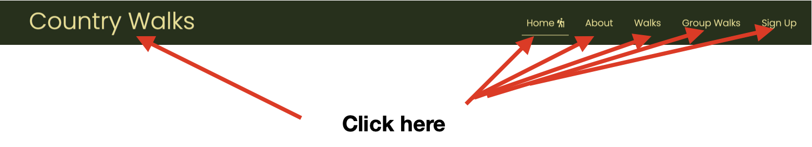

## Bugs 

- Group walks page has a larger gap between the next group walks section and the footer. Attempted to fix, but no success yet. Working on fix. 
- About Us image gallery has an odd number of images so when the media queriess kick and reduce column count to 2 it presents a stand alone image at the bottom of the page. Looking at reducing number of images or adding an addtional one, though this may present issues for viewing at larger screen sizes.
- Relating to the first issue, Firefox displays the web pages with not enough gap between the footer and the section that lives above it. Working on fix.
- 404 seems to need a cache clear to work properly. Struggling to keep consistent. 
- Using inspect mode on my computer to view screen responsiveness seems to work fine, but have seen some elements not display correctly on others machine when using this mode. Tested on smaller mobile screens and seems fine, but inspect shows something different for other people. Can't find fix for it, but looks correct from my inspect mode and screen.

## Deployment 

This website was deployed using GitHub Pages following these steps:

1. In the GitHub repository click on the settings tab at the top
2. On the left menu scrtoll down and select pages
3. For the source select 'main'
4. The webpage will refresh and display a highlighted section with a message stating: "Your website is published at https://bcookesley.github.io/CI_pp1_country-walks/" 

The repository can be forked by following these steps: 

1. Go to the GitHub repository
2. Click on fork in the top right hand corner

To clone the repository:

1. Go to the GitHub repository
2. Click on where it says 'Code' at the top of the repository
3. Select to clone either HTML, SSH or GitHub CLI
4. Go to the working directory you wish to work from
5. Go to Git Bash
6. Type git clone and paste the URL from your clipboard ($ git clone https://github.com/USERNAME/REPOSITORY)
7. Press enter to create your clone

## Credits 

### Media 

Images were sourced from Unsplash and credits to the photographers are detailed below.

- Carousel-1: [Aaron Burden](https://unsplash.com/photos/G_1V58E0TyM) (Unsplash Image)
- Carousel-2: [Tim Foster](https://unsplash.com/photos/lSegRSDBMLw) (Unsplash Image)
- Carousel-3: [Luca Micheli](https://unsplash.com/photos/r9RW20TrQ0Y) (Unsplash Image)
- About Us page Hero Image - [Magda V](https://unsplash.com/photos/NTtpEsUSagg) (Unsplash image)
- Gallery Section on about us page - [Yevhenii Dubrovski](https://unsplash.com/photos/4hfPfuYB14k), [Jake Melara](https://unsplash.com/photos/Yh6K2eTr_FY), [Katie McBroom](https://unsplash.com/photos/-Tvjzjcji2k), Kitera Dent, [Angelo Pantazis](https://unsplash.com/photos/zXVk8mNl9M0), [Jon Flobrant](https://unsplash.com/photos/_r19nfvS3wY), [Aaron Burden](https://unsplash.com/photos/G_1V58E0TyM) (Unsplash)
- Group Walks image - [Jon Flobrant](https://unsplash.com/photos/_r19nfvS3wY) (Unsplash)
- Walks Page images - [Robert Cook](https://unsplash.com/photos/TKMUt6sFQyw) (Pub Walk), [Annie Spratt](https://unsplash.com/photos/GPCgLbBevQg) (Long Walk), [Katie McBroom](https://unsplash.com/photos/-Tvjzjcji2k) (Medium Walk), [Greg Wilson](https://unsplash.com/photos/aGutO88lNEI) (Short Walk), [Nick Fewings](https://unsplash.com/photos/nyI87MyygaA) (Most Popular) - (Unsplash)
- Sign Up page hero image - [Luca Micheli](https://unsplash.com/photos/r9RW20TrQ0Y) (Unsplash)
- [404 page](https://github.com/bcookesley/CI_pp1_country-walks/blob/main/404.html) Image supplied by [Freepik](https://www.freepik.com/)

### Code 

- The HTML for the responsive [Navbar with Toggler](https://getbootstrap.com/docs/5.0/components/navbar/#toggler) was taken from Bootstrap V 5.1 documentation code snippet.
- The [Carousel](https://getbootstrap.com/docs/5.1/components/carousel/) on the index page was taken from Bootstrap V 5.1 documentation code snippet
- Code Institute - Love Running project: Some code was inspired and may appear very similar in some sections of HTML and CSS code
- [Font Awesome](https://fontawesome.com/) for the icons used
- [Google](https://www.google.co.uk/) for the fonts and maps
- [Ana](https://github.com/4n4ru) for the references 

## Acknowledgements

I would like to give my thanks to:

- Mo Shami for the guidance and support he offered through this
- To my loving partner Cazz Pickles for her support and inspiration she gave for the project
- All the people at Code institute 
- And to my cat Zuzu for keeping me company
